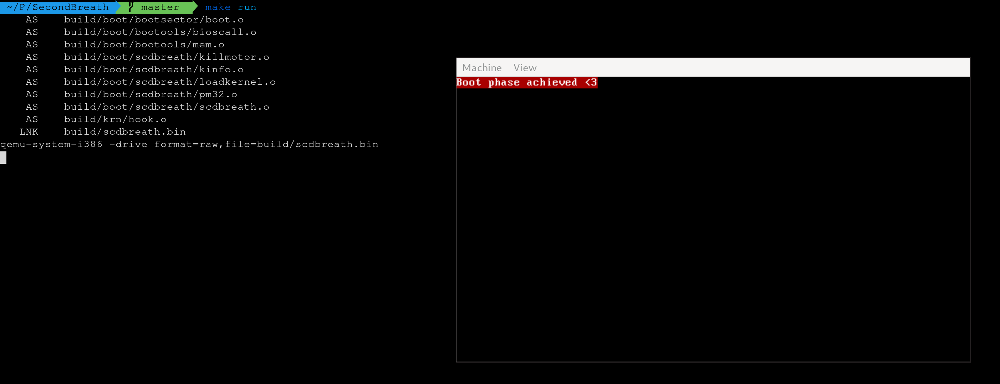

# SecondBreath

x86 bootloader wroten in GNU syntax assembly.

One of many 2 stages minimal bootloader (which load the Kernel in higher half).

# Dependencies

  * `make` (dev under V4.3)

  * `as` (dev under V2.34)

  * `ld` (dev under V2.34)

# Build

`make arch=$ARCH`

Where `$ARCH` is the arch you want to target.

Available are `x86` and `x64` (defaulting to x86 if unset).

# Tree

| Path     | Description             |
|----------|-------------------------|
| `arch`   | Arch-specific objects   |
| `boot`   | The purposed bootloader |
| `krn`    | A kernel entry          |

## x86 Memory map

| Binary Offset        | Virtual Address      | Description
|----------------------|----------------------|-------------
| `0x0` - `0x200`      | `0x7C00` - `0x7E00`  | DOS bootsector
| `0x200` - `0x8400`   | `0x7E00` - `0x10000` | Bootloader second breath
| `0x10000` - `...`    | `0xC0010000` - `...` | Kernel

## x64 Memory map (not implemented yet)

| Binary Offset        | Virtual Address              | Description
|----------------------|------------------------------|-------------
| `0x0` - `0x200`      | `0x7C00` - `0x7E00`          | DOS bootsector
| `0x200` - `0x8400`   | `0x7E00` - `0x10000`         | Bootloader second breath
| `0x10000` - `...`    | `0xFFFFFFFF80010000` - `...` | Kernel

## Bootloader steps

- [X] Load the `stage 2` bootloader
- [X] Enable `A20` by all means
- [X] Load the `GDT`
- [X] Load the totality of the kernel at `0x10000`
- [ ] Setup some informations for kernel usage
- [X] Enable `Protected Mode`
- [X] Transfer control to the kernel

# About

A kernel entry is provided in `krn` directory.

To use this bootloader you must provide the classical symbol entry `_start`.

The kernel is loaded in higher half but no memory mapping is provided by the bootloader so far.

You must then use a `virtToPhys` operation on every absolute addressing.

# Epilogue

Just for the fun.

Feel free to fork, use, improve.
